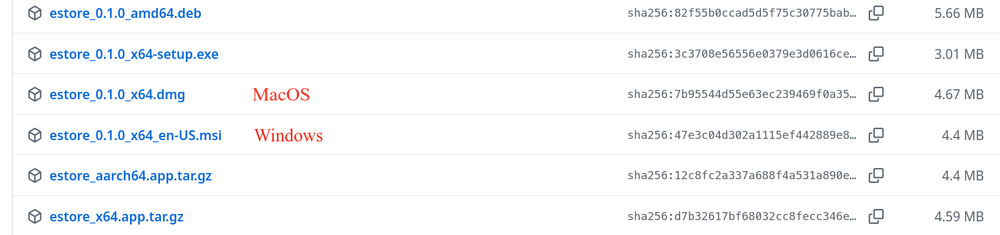

# 商品交易 APP

基于 Tauri v2 和 Go Gin 开发的玩具项目——一个功能欠缺的商品交易平台桌面应用。

## 安装

客户端安装请前往[release](https://github.com/EmmetZ/CS3331-estore/releases/latest)页面下载对应平台的安装包。

## 软件功能

- [x] 用户注册、登录、登出
- [x] 商品浏览、搜索、查看详情
- [x] 商品发布、删除
- [x] 用户信息查看与修改
- [x] 管理员用户管理、商品管理

## 开发指南

技术栈

1. 客户端：Tauri v2 + React + Vite + Tailwind CSS
2. 服务端：Go + Gin + GORM
3. 数据库：MySQL

## 用例分析

详见[用例分析文档](./docs/usecase.md)
