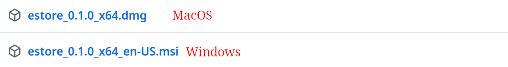
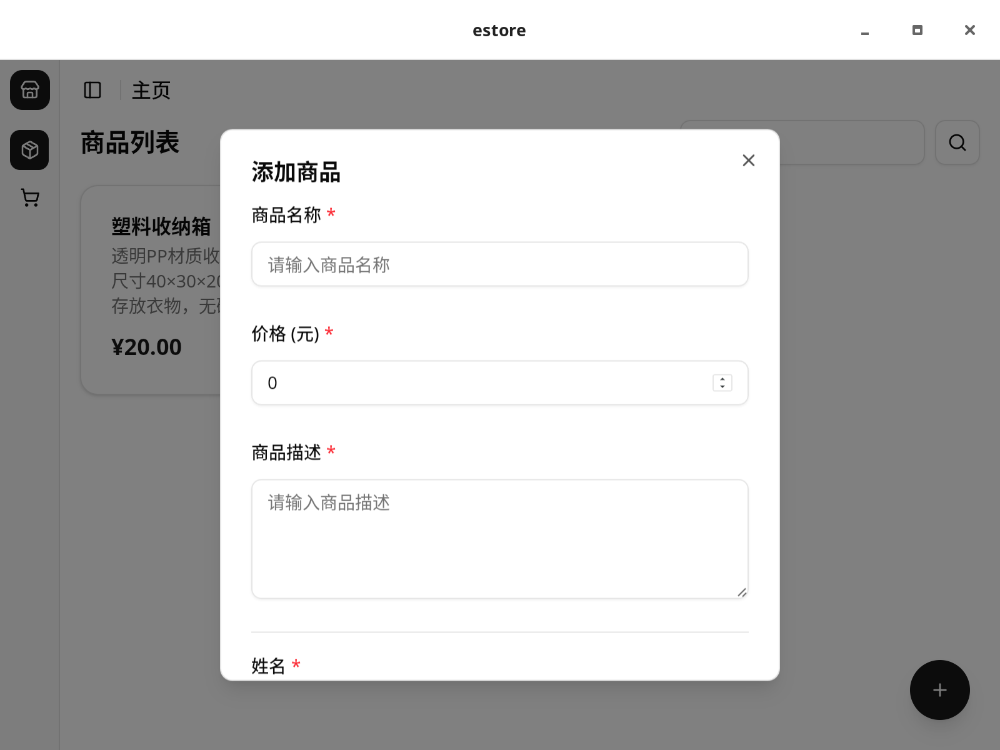
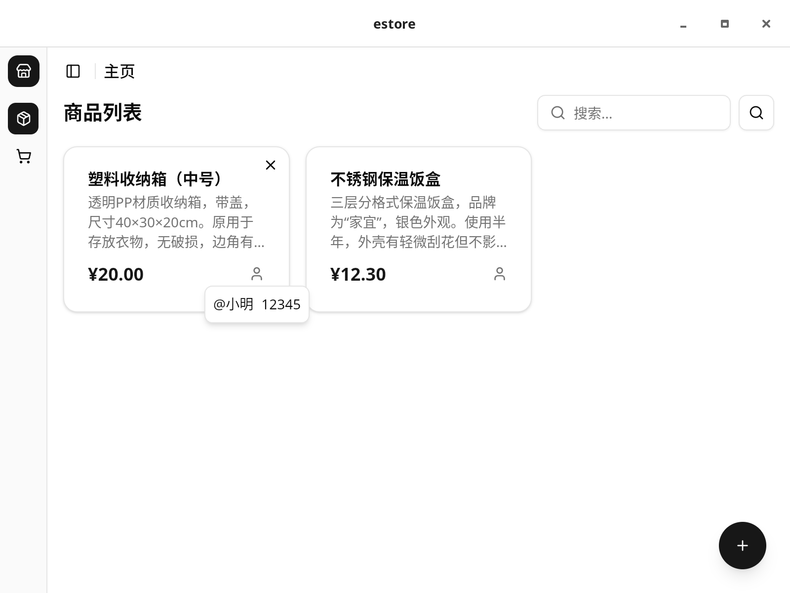
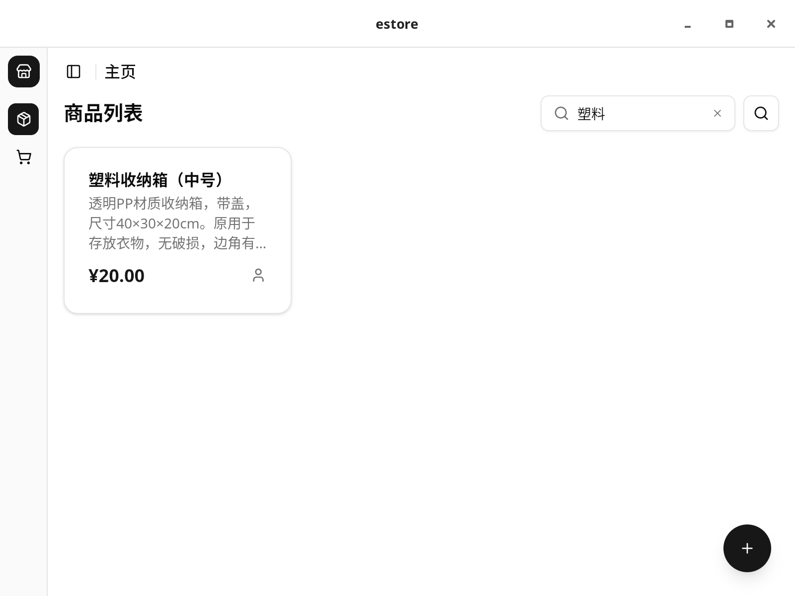
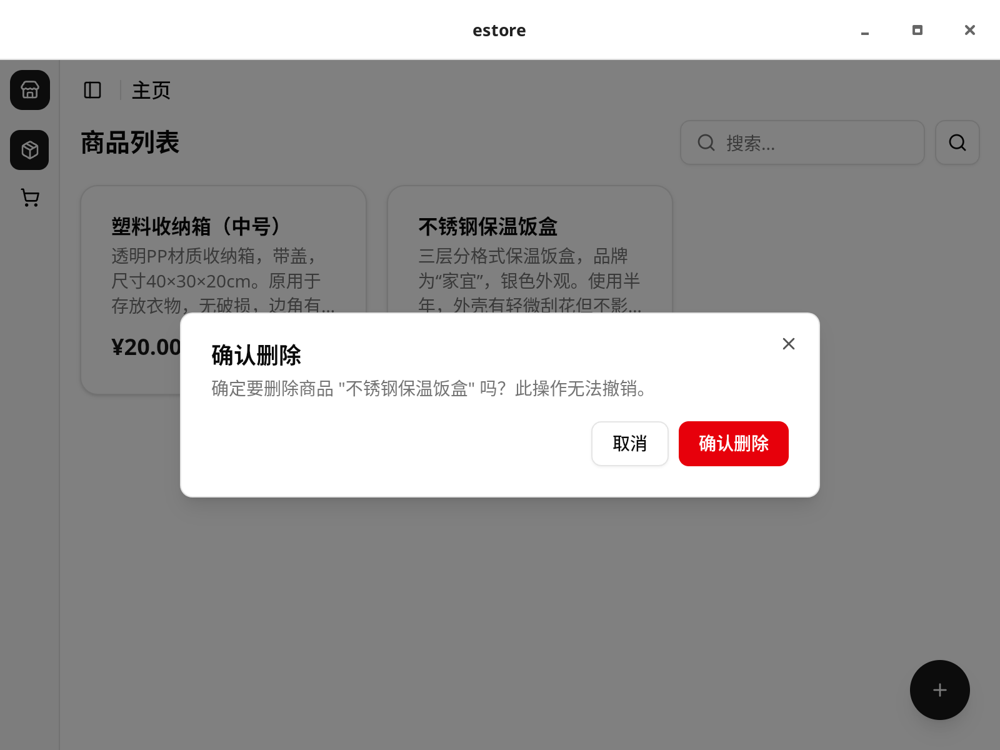

# 商品交易 APP

## 下载

请前往[release](https://github.com/EmmetZ/CS3331-estore/releases/latest)页面下载对应平台的安装包。

## 软件功能

1. 添加物品
2. 搜索物品名称或描述
3. 显示物品列表
4. 删除物品

## 使用方法

### 添加物品

点击右下角的加号按钮，填写物品名称和描述，然后点击保存。

### 物品列表

在主界面可以看到所有添加的物品，点击物品可以查看详情。

### 搜索物品

在顶部的搜索栏中输入关键词，实时过滤物品列表。

### 删除物品

点击物品卡票右上角的删除按钮，确认后删除该物品。

