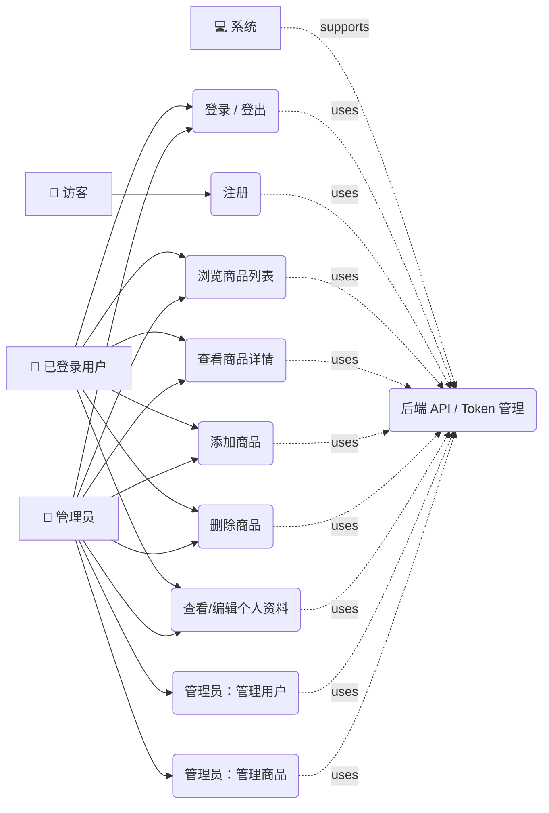
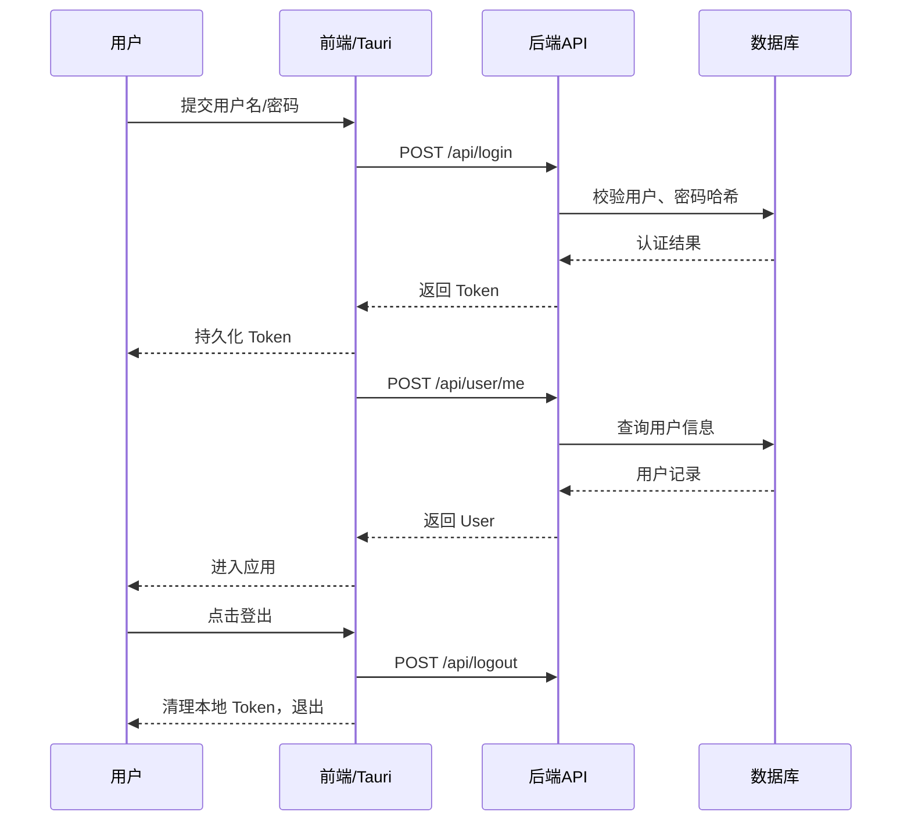
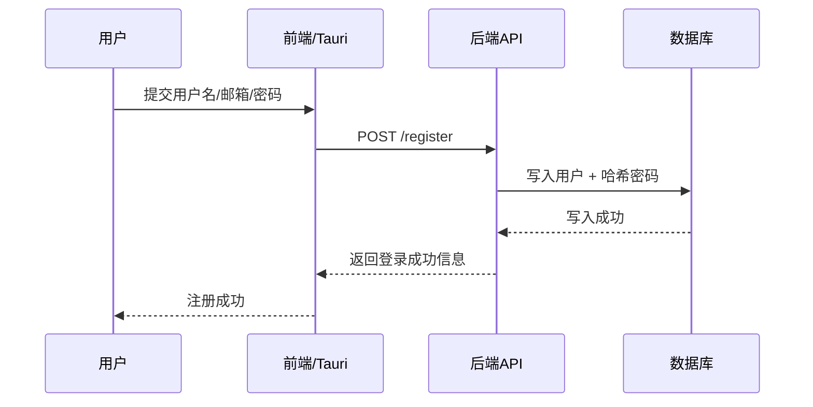
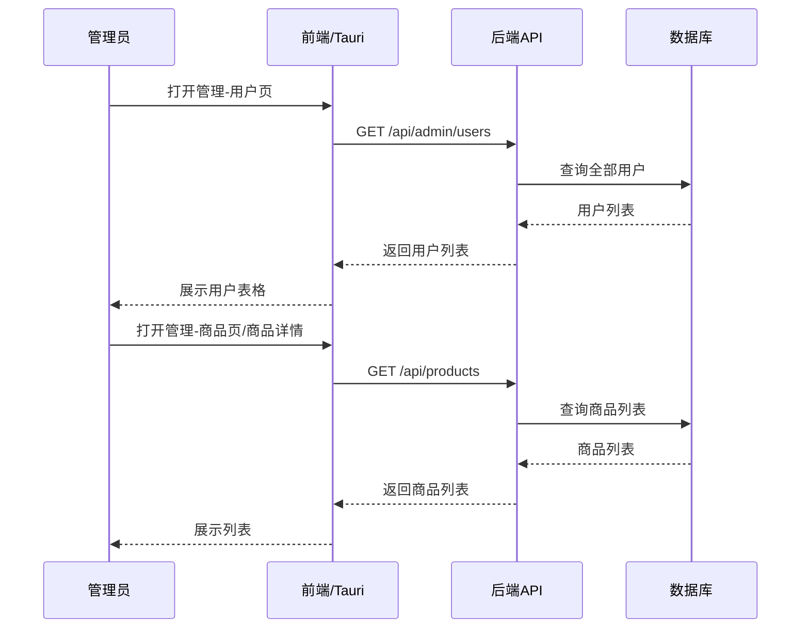
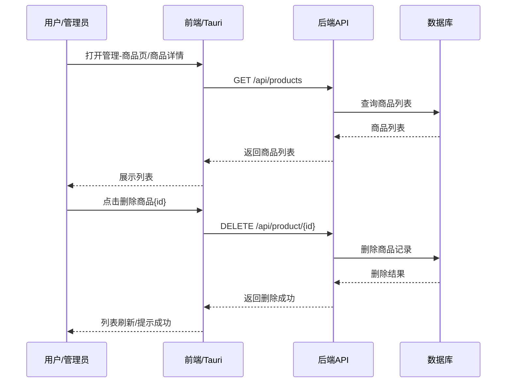
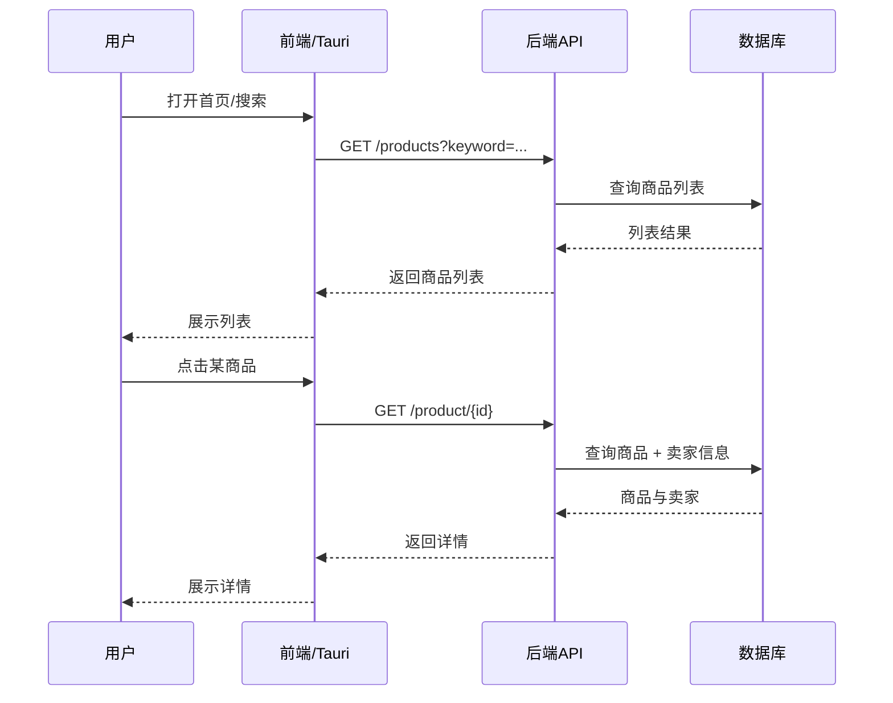
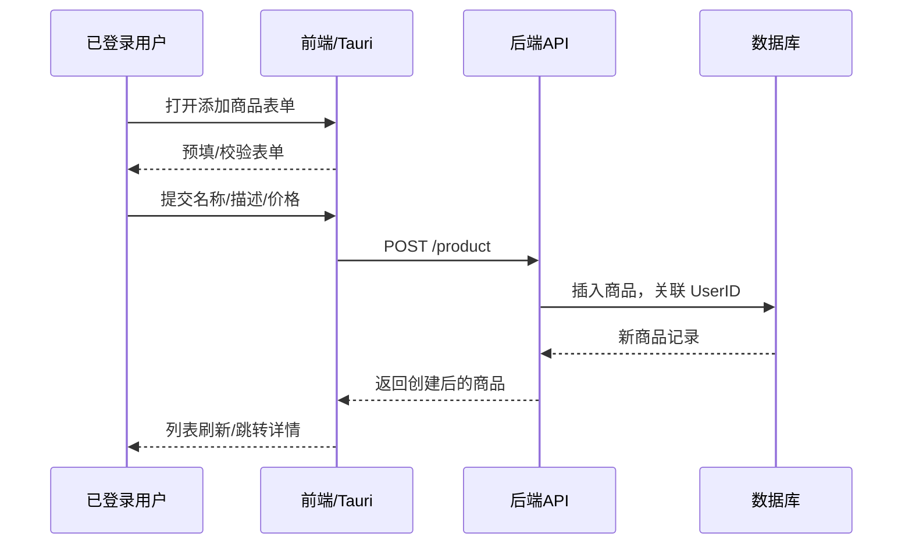

# 用例分析

项目分为客户端和服务端两部分。

## 参与者

- 访客 / 未登录用户
- 已登录用户
- 管理员
- 系统（后端服务、Tauri 客户端）

## 主要用例

1. 浏览商品列表
   - 主参与者：访客/已登录用户
   - 前置条件：无
   - 主流程：访问主页 → 搜索/查看商品列表

2. 查看商品详情
   - 主参与者：访客/已登录用户
   - 前置条件：存在有效商品 ID
   - 主流程：点击商品 → 打开详情页 → 请求商品详情

3. 添加商品
   - 主参与者：已登录用户
   - 前置条件：用户已登录（有权限）
   - 主流程：点击加号 → 填表提交 → 客户端调用创建接口 → 后端持久化商品

4. 删除商品
   - 主参与者：卖家（商品所属用户）或管理员
   - 前置条件：有删除权限（是卖家或管理员）
   - 主流程：在详情页发起删除 → 客户端调用删除接口 → 后端删除记录

5. 登录 / 登出
   - 主参与者：访客（注册/登录）
   - 前置条件：无（登录），已登录（登出）
   - 主流程：填写凭证 → 调用认证接口 → 更新本地会话/Token → 获取当前用户信息

6. 注册
   - 主参与者：访客
   - 前置条件：无
   - 主流程：填写注册信息 → 调用注册接口 → 创建用户 → 自动登录

7. 查看/编辑个人资料
   - 主参与者：已登录用户
   - 前置条件：已登录并获取当前用户信息
   - 主流程：进入个人页面 → 查看信息或切换到编辑 → 提交更新 → 后端更新并返回最新用户

8. 管理员面板（用户与商品管理）
   - 主参与者：管理员
   - 前置条件：用户是管理员（user.is_admin === true）
   - 主流程：打开管理页 → 切换标签（用户/商品） → 执行管理操作（刷新、删除等）

9. 后端 API 调用 / Token 管理（系统用例）
   - 主参与者：系统（Tauri 客户端 + 服务器）
   - 前置条件：Tauri 客户端运行，token 数据文件夹已初始化
   - 主流程：客户端发起 HTTP 请求 → 处理 token 刷新/存储 → 返回 ApiResponse 给前端

## 用例图

## 顺序图

### 登录 / 登出

### 注册

### 管理员查看

### 删除商品

> 管理员与商品所有者共用同一商品接口（/api/product/:id），后端会在控制器内放行管理员。

### 浏览/查看商品详情

### 添加商品（已登录用户）

## 类图

```mermaid
classDiagram
    %% Backend Models
    class User {
        -uint ID
        -string Username
        -string Email
        -string Phone
        -string Address
        -bool IsAdmin
        +Product[] Products
    }

    class UserAuth {
        -uint ID
        -string Password
    }

    class Product {
        -uint ID
        -string Name
        -string Description
        -int Price
        -time CreatedAt
        -uint UserID
        +User User
    }

    %% Backend DTOs
    class RegisterRequest {
        -string Username
        -string Email
        -string Password
    }

    class UpdateUserRequest {
        -string Username
        -string Email
        -string Phone
        -string Address
    }

    class UpdatePasswordRequest {
        -string OldPassword
        -string NewPassword
    }

    class UserDTO {
        -uint ID
        -string Username
        -string Email
        -string Phone
        -string Address
        -bool IsAdmin
    }

    class CreateProductRequest {
        -string Name
        -string Description
        -int Price
    }

    class UpdateProductRequest {
        -string Name
        -string Description
        -int Price
    }

    class ProductResponse {
        -uint ID
        -string Name
        -string Description
        -int Price
        -Seller Seller
    }

    class Seller {
        -uint ID
        -string Username
        -string Email
        -string Phone
        -string Address
    }

    %% Service Interfaces and Implementations
    class ProductService {
        <<interface>>
        +CreateProduct(userID uint, name, description string, price int)*
        +GetProduct(productID uint)*
        +UpdateProduct(productID uint, name, description string, price int)*
        +DeleteProduct(productID uint)*
        +SearchProducts(keyword string)*
    }

    class ProductServiceImpl {
        -DB* DB
        +CreateProduct(userID uint, name, description string, price int) Product
        +GetProduct(productID uint) Product
        +UpdateProduct(productID uint, name, description string, price int) Product
        +DeleteProduct(productID uint) error
        +SearchProducts(keyword string) Product[]
    }

    class UserService {
        <<interface>>
        +GetUser(userID uint)*
        +GetAllUsers()*
        +UpdateUser(userID uint, username, email, phone, address string)*
        +UpdateUserPassword(userID uint, oldPassword, newPassword string)*
        +DeleteUser(userID uint)*
    }

    class UserServiceImpl {
        -DB* DB
        +GetUser(userID uint) User
        +GetAllUsers() User[]
        +UpdateUser(userID uint, username, email, phone, address string) User
        +UpdateUserPassword(userID uint, oldPassword, newPassword string) error
        +DeleteUser(userID uint) error
    }

    class AuthService {
        <<interface>>
        +LoginAuthenticator(c gin.Context)*
        +RegisterUser(username, email, password string)*
    }

    class AuthServiceImpl {
        -DB* DB
        -UserService UserService
        +LoginAuthenticator(c gin.Context) any
        +RegisterUser(username, email, password string) error
    }

    %% Frontend Types
    class ApiResponse {
        <<interface>>
        -int code
        -string message
        -bool success
        -T data
    }

    class FrontendUser {
        -int id
        -string username
        -string email
        -string phone
        -string address
        -bool is_admin
    }

    class FrontendProduct {
        -int id
        -string name
        -string description
        -int price
        -Seller? seller
    }

    class LoginPayload {
        -string username
        -string password
    }

    class RegisterPayload {
        -string username
        -string email
        -string password
    }

    class ProductFormData {
        -string name
        -string description
        -int price
    }

    %% Relationships
    User "1" -- "1" UserAuth : has
    User "1" -- "*" Product : creates
    Product "*" -- "1" User : belongsTo

    ProductServiceImpl --|> ProductService : implements
    UserServiceImpl --|> UserService : implements
    AuthServiceImpl --|> AuthService : implements

    UserDTO --|> User : mapsFrom
    ProductResponse --|> Product : mapsFrom
    Seller --|> User : extractedFrom

    RegisterRequest --|> User : convertsTo
    UpdateUserRequest --|> User : updates
    CreateProductRequest --|> Product : convertsTo
    UpdateProductRequest --|> Product : updates

    AuthServiceImpl --> UserService : uses
    ProductServiceImpl --> Product : persists
    UserServiceImpl --> User : persists

    ApiResponse --> FrontendUser : contains
    ApiResponse --> FrontendProduct : contains
    FrontendProduct "1" -- "1" Seller : hasA

    LoginPayload --> AuthService : usedBy
    ProductFormData --> CreateProductRequest : convertsTo
```

<!-- TODO -->

